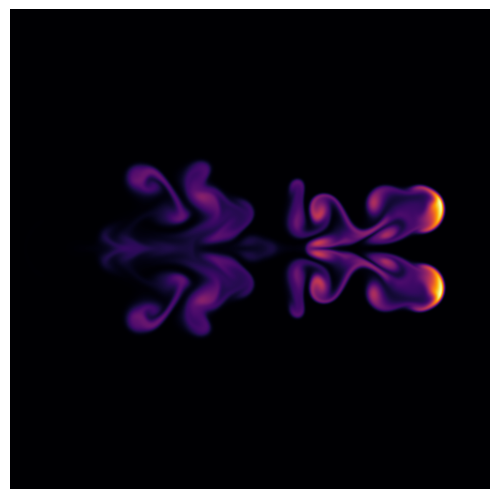
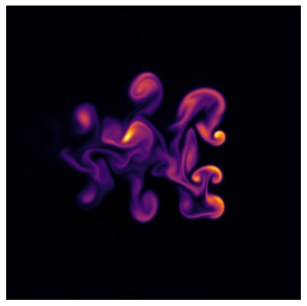
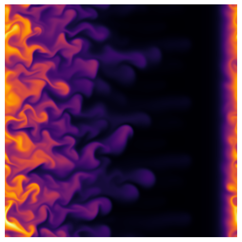

# Tokam2D - Structure detection in fusion plasma simulations in codabench

<table style="width:100%; background-color:transparent;">
  <tr style="background-color:transparent;">
    <td align="left"; style="background-color:transparent; width: 40%;">
        
    </td>
    <td align="right"; style="background-color:transparent; width: 40%;">
        
    </td>
  </tr>
 </table>

## Context

The objective of magnetic confinement fusion is to build a nuclear fusion energy reactor. To achieve this, fusion scientists confine a plasma (a gas of charged particles) using a strong magnetic field and heat it to temperatures at which nuclear fusion reactions can occur.

One of the main obstacles to this goal is **turbulent transport**. Turbulence in the plasma gives rise to intermittent flows that carry heat and particles away from the hot plasma core toward the vessel walls, thereby preventing the plasma from reaching and sustaining fusion-relevant conditions.

A key feature of turbulent transport is the formation of coherent, localized structures known as blobs. These structures are regions of enhanced plasma density that detach from the core and propagate outward. Blobs are believed to be responsible for a significant fraction of cross-field transport in magnetically confined plasmas.

The goal of this challenge is to explore how such turbulent structures can be **automatically detected (and possibly tracked)** in plasma simulation data.

## Data description

The data consist of image frames extracted from simulation movies showing the plasma density field. In these images, blobs appear as overdense, mushroom-like structures moving through the plasma toward the wall.

For training, you will have access to two simulation movies:
- **blob_i**,
- **blob_dwi**.

In these movies, a single blob is clearly visible and propagates through the domain, providing relatively simple examples of blob dynamics.

Your model will be evaluated on a more complex simulation, **turb_dwi**, in which blobs form spontaneously and appear in a much larger and more crowded population. This setting is significantly more challenging and is designed to test your model’s ability to generalize to unseen and more realistic turbulent conditions.

To help you assess generalization before submission, a limited number of frames from _turb_dwi_ are provided **for visual inspection and pre-testing only**.

An additional, fully unannotated movie, **turb_i**, is also provided and may be used for unsupervised or self-supervised approaches.

Below are displayed sample frames from the three annotated movies of the challenge dataset.

|  |  |  |
|--------------------------|----------------------------|----------------------------|
| _blob_i_                 | _blob_dwi_                 | _turb_dwi_                 |

:warning: **Important:**
Only _blob_i_, _blob_dwi_, and _turb_i_ may be used for training and validation.
Frames from _turb_dwi_ must **not** be used during training. Submissions that incorporate _turb_dwi_ data into the training loop will be penalized.

## Task

The task is to **detect blobs in each frame** by predicting bounding boxes around the blob front (single class: `blob_front`). You may use spatial information only, temporal information, or a combination of both.

## Metric

Performance is evaluated using **AP50 based on Intersection-over-Mean (IoMean)**, a metric inspired by the COCO mean Average Precision.

For two bounding boxes, IoMean is defined as:

$$
\text{IoMean} = \frac{2\text{Area of Intersection}}{\text{Area}_1 + \text{Area}_2}
$$

Compared to standard IoU-based AP:

- The matching criterion uses **IoMean** instead of IoU, allowing for more loosely defined and irregular blob contours.
- Only a single threshold (IoMean ≥ 0.5) is used.
- There is only one object class (`blob_front`).

This metric is designed to better reflect the physical ambiguity of blob boundaries in turbulent plasma simulations.
